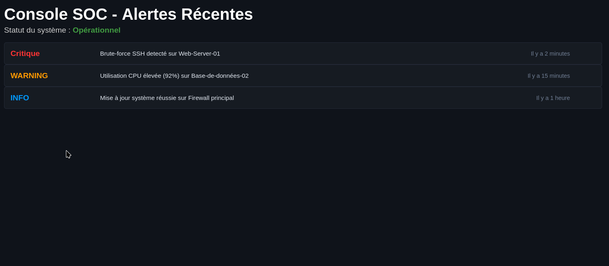
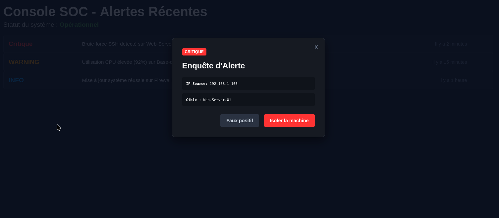

# 🛡️ Console SOC - Interface d'Investigation d'Alertes

Ce projet est une maquette fonctionnelle et minimaliste d'un tableau de bord de **SOC (Security Operations Center)**. Il applique les principes du Design Centré sur l'Utilisateur (UX/UI) pour répondre aux besoins d'analyse rapide de la **Blue Team**.

## 🚀 Fonctionnalités Appliquées

- **Dashboard de Fond :** Une liste d'alertes triées par criticité (Critique, Warning, Info) avec un code couleur adapté à la gestion des urgences.
- **Modale d'Investigation (100% CSS) :** Superposition d'une fenêtre d'analyse détaillée lors du clic sur l'alerte critique, utilisant la pseudo-classe `:target` pour éviter l'usage de JavaScript.
- **Design Cyber (Dark Mode) :** Palette de couleurs sombres (`#0f131a` et `#161b22`) pour réduire la fatigue visuelle des analystes, combinée à une typographie `monospace` pour la lecture des données techniques (IP, serveurs).

## 🛠️ Technologies Utilisées

- **HTML5** : Structure sémantique (utilisation des balises `<header>`, `<main>`, `<section>`, et `<article>`).
- **CSS3** : Alignements horizontaux via `inline-block`, gestion des superpositions (`position: fixed`) et gestion des états graphiques (`:target`).

## Screenshot 

## 🚀 Live Demo

https://cedricboucard.github.io/Console-SOC/#